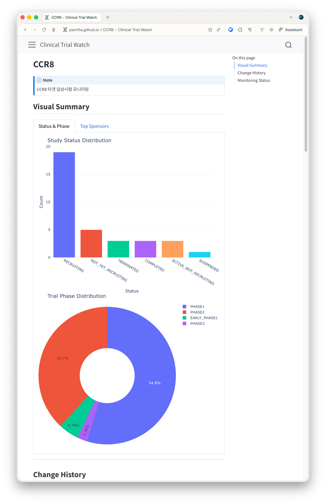

# Clinical Trial Watch



이 프로젝트는 ClinicalTrials.gov API를 사용하여 특정 치료 타겟에 대한 임상시험의 변동 사항을 정기적으로 모니터링하고, 그 결과를 Quarto 기반의 웹사이트로 배포하는 자동화 시스템입니다.

## 할일

- [ ] snapshot을 json에서 duckdb로 전환하기
- [ ] 단순 키워드 검색 뿐만 아니라 fuzzy search를 적용해 NCT code 찾기
- [x] 잘못들어간 NCT code를 제거하는 관리 기능

## 주요 기능

- 자동 탐색 (Auto-Discovery): `trials.yaml`에 정의된 타겟을 바탕으로 ClinicalTrials.gov API를 검색하여 새로운 임상시험을 자동으로 추가합니다.
- 정기 크롤링: ClinicalTrials.gov API v2를 사용하여 최신 임상 데이터를 가져옵니다.
- 상태 변화 감지: 이전 스냅샷과 비교하여 모집 현황(Recruitment Status), 단계(Phase), 예상 종료일(Primary Completion Date) 등의 주요 필드 변화를 지능적으로 추적합니다.
- 개별 임상시험 추적: 타겟별 통합 모니터링뿐만 아니라 각 NCT ID별 상세 변경 이력(Before/After)을 추적하고 독립된 페이지로 렌더링합니다.
- 자동 배포: GitHub Actions를 통해 매일 정해진 시간에 작업을 수행하고, 변경 사항이 있을 경우 GitHub Pages에 업데이트된 리포트를 배포합니다.
- 브라우징: Quarto로 생성된 웹 페이지를 통해 현재 상태 요약과 전체 변경 이력을 대화형 시각화와 함께 확인할 수 있습니다.

## 프로젝트 구조

- `src/`: 핵심 로직 소스 코드
  - `auto_discover_trials.py`: 새 임상시험 자동 탐색 및 `trials.yaml` 업데이트
  - `crawler.py`: API 데이터 수집
  - `diff_engine.py`: 데이터 비교 및 리포트 생성
  - `main.py`: 데이터 수집 및 전체 프로세스 코디네이션
  - `generate_target_pages.py`: 타겟 및 개별 임상시험의 Quarto `.qmd` 문서 자동 생성
  - `manage_trials.py`: 특정 임상시험(NCT) 제거 및 데이터 관리
  - `update_trials_from_csv.py`: CSV 파일을 통한 임상시험 일괄 추가
- `data/`: 데이터 저장소
  - `snapshots/`: 각 임상의 최신 JSON 스냅샷
  - `history/`: 감지된 전체 변경 이력
- `targets/`: (자동 생성) 타겟별 요약 및 데일리 변경 이력을 보여주는 Quarto 페이지
- `trials/`: (자동 생성) 개별 임상시험 상세 변경 이력(표 형태)을 보여주는 Quarto 페이지
- `trials.yaml`: 모니터링할 임상 목록 설정
- `.github/workflows/daily-watch.yml`: 자동화 워크플로우

## 시작하기

이 프로젝트는 패키지 관리를 위해 `pixi`를 사용합니다.

### 설치 및 실행

```bash
# 의존성 설치 및 환경 구축
pixi install

# 로컬에서 새로운 임상시험 탐색 스크립트 실행 (선택 사항)
pixi run python src/auto_discover_trials.py

# 로컬에서 모니터링 스크립트 실행
pixi run python src/main.py

# Quarto 웹사이트 미리보기
pixi run quarto preview
```

### 모니터링 대상 일괄 추가 (CSV 활용)

`NCT Number`, `Study Title` 컬럼이 포함된 CSV 파일을 사용하여 특정 타겟에 임상시험을 일괄 추가할 수 있습니다.

```bash
# CCR8 타겟에 CSV 데이터 추가
pixi run python src/update_trials_from_csv.py --target CCR8 --csv data/ctg-studies.csv

# 새 타겟(TIGIT) 생성 및 추가
pixi run python src/update_trials_from_csv.py --target TIGIT --csv data/ctg-studies_tigit.csv

# 옵션
#   --target, -t : 타겟 이름 (필수)
#   --csv, -c    : CSV 파일 경로 (기본값: data/ctg-studies.csv)
#   --replace    : 기존 trials 대체 (기본값: 추가)
```

### 임상시험 데이터 관리 및 제거

잘못 포함된 임상시험 코드를 추적 목록에서 제외하고 관련된 히스토리와 스냅샷 데이터를 삭제할 수 있습니다.

```bash
# 특정 임상시험(NCT ID)을 삭제하고 관련 파일까지 정리(--cleanup)
pixi run python src/manage_trials.py remove --id NCT12345678 --cleanup
```

## 기술 스택

* Language: Python 3.11+
* Dependency Management: Pixi
* Libraries: `requests`, `deepdiff`, `PyYAML`
* Visualization: Quarto, GitHub Pages
* Automation: GitHub Actions
